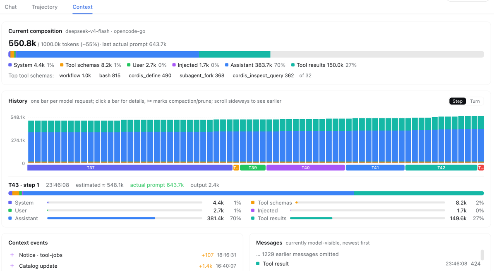

# dsh-context

A **Context insight panel** for [DeepSeek Harness](https://github.com/deepseek-ai/DeepSeek-Harness) (dsh): a plugin that adds a **Context** tab to the web UI — right beside **Chat** and **Trajectory** — so you can see what the model's context window is actually made of, and how it evolves across the conversation.



## Why

Every model request packs the same window from six sources: the system prompt, tool schemas, your messages, injected context (skills, AGENTS.md, runtime snapshots), assistant replies, and tool results. When a conversation degrades or gets compacted, *which part ate the budget* is usually invisible. dsh-context makes it observable:

- **Current composition** — a stacked bar of the six categories, scaled against the model's context window (the gray track is your remaining headroom), plus the top-5 most expensive tool schemas.
- **History** — one stacked bar per model request (finer than per-turn), with Y-axis ticks and gridlines. Click any bar for its full breakdown, including the **provider-reported** prompt/output tokens next to the estimate. ✂ marks where compaction/pruning happened — watch the bars drop.
- **Context events** — compactions, tool-output prunes, skill injections (`Skill injected (code-review)`), plugin context injections, model switches — each with its token delta and timestamp.
- **Messages** — the currently model-visible surface, message by message, with per-message token costs.

The UI is bilingual (中文/English) and follows the dsh locale automatically.

## Install

dsh-context is a **dynamic Cordis plugin**: two plain-JavaScript halves (`host.js`, `client.js`) loaded into a running dsh process — no build step, no restart.

### Option 1: ask the agent (easiest)

In any dsh session with the Cordis tools available, say:

> 加载 ~/dev/dsh-context 里的 dsh 插件（host.js + client.js），用 cordis_define 和 cordis_run 运行

The agent will define the package and run it; approve the client bundle when prompted, and the **Context** tab appears in every session view.

### Option 2: load it yourself

Call `cordis_define` with the file contents as `code.host` / `code.client`, then `cordis_run`:

```js
// code.host   = contents of host.js
// code.client = contents of client.js
cordis_define({ plugin: { kind: 'new', idPrefix: 'dctx' }, name: 'dsh-context', purpose: '…', code })
cordis_run({ pluginId, packageId, mode: 'run' })
```

> Dynamic plugins are process-local: they disappear when dsh restarts. To make it permanent, wrap the two halves as a plugin package (a `package.json` with a `dsh` field, like [`@deepseek-ai/dsh-client-ui-trajectory`](https://github.com/deepseek-ai/DeepSeek-Harness/tree/master/packages/client/ui-trajectory)) and add a row to your agent preset's `cordis.yml` — see the [dsh plugin docs](https://deepseek-harness.github.io/deepseek-harness/develop/).

## Usage

Open any session and click **上下文 / Context** (to the right of Chat and Trajectory). Data refreshes every 2 seconds while the tab is open; switching sessions switches the view to that session's log — including historical, persisted sessions.

- **Hover** a history bar for a quick tooltip; **click** it to pin the breakdown below the chart.
- The overview bar is scaled to the model's context window, so ~13% full means ~13% of the window is spoken for.
- Numbers are estimates using the *same fixed-density heuristic as dsh's built-in tokenMeter* (~4 chars ≈ 1 token), so they match the harness's own stats. Wherever the provider reported real usage, it's shown alongside as "actual".

## How it works

- **Data source**: the session's durable event log. Live sessions are folded straight from the in-memory log (`sessions.get(id).events` — no clone, no disk parse); persisted sessions fall back to `sessionQuery.readSession`.
- **Incremental fold**: per-session fold state lives in the Host half, so each poll only processes newly appended events — reopening the tab is instant.
- **Events decoded**: `request/header` (system prompt + tool schemas), surface events with `surfaceOp` (append/replace — compaction rewrites history in place), `compaction/summary|prune`, `assistant/message.usage` (real provider tokens), and message `source` metadata (`plugin` forms, `skill-invocation`) for injection events.
- **Architecture**: `host.js` folds the log and serves a package-private `snapshot` RPC; `client.js` registers the tab in the `conversation.view` slot and renders with bare `React.createElement` — zero dependencies, theme-native via dsh CSS variables.

## Files

| File | Role |
| --- | --- |
| `host.js` | Host half: incremental log fold, category accounting, `snapshot` RPC |
| `client.js` | Client half: tab registration, bilingual chart UI |
| `docs/screenshot.png` | The UI in action |

## License

MIT
